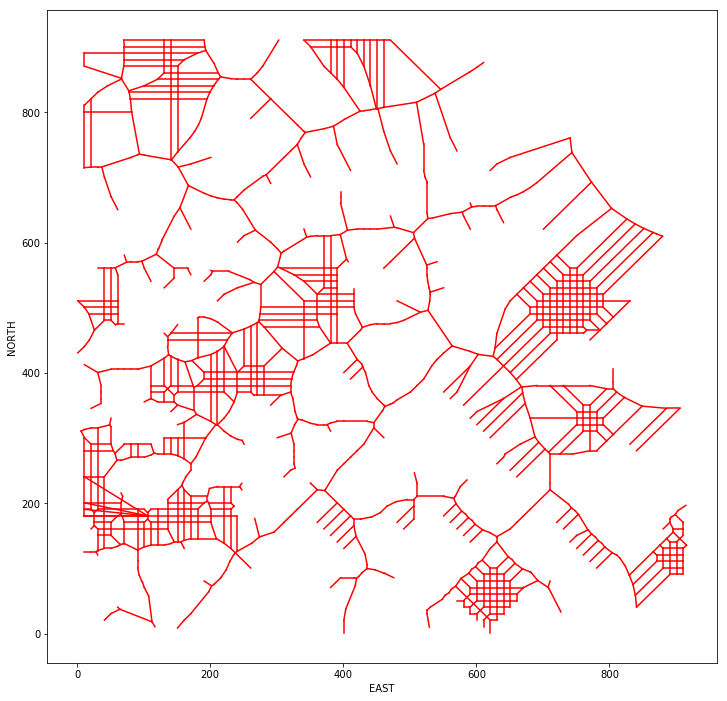
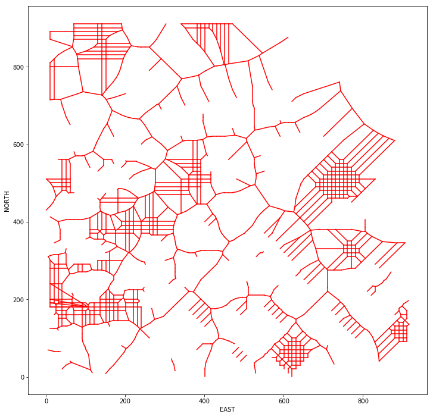
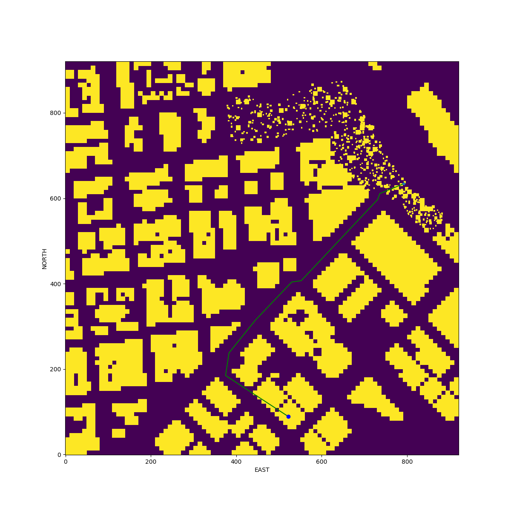

## Project: 3D Motion Planning


---


# Required Steps for a Passing Submission:
1. Load the 2.5D map in the colliders.csv file describing the environment.
2. Discretize the environment into a grid or graph representation.
3. Define the start and goal locations.
4. Perform a search using A* or other search algorithm.
5. Use a collinearity test or ray tracing method (like Bresenham) to remove unnecessary waypoints.
6. Return waypoints in local ECEF coordinates (format for `self.all_waypoints` is [N, E, altitude, heading], where the drone’s start location corresponds to [0, 0, 0, 0].
7. Write it up.
8. Congratulations!  Your Done!

## [Rubric](https://review.udacity.com/#!/rubrics/1534/view) Points
### Here I will consider the rubric points individually and describe how I addressed each point in my implementation.  

---
### Writeup / README

#### 1. Provide a Writeup / README that includes all the rubric points and how you addressed each one.  You can submit your writeup as markdown or pdf.  

You're reading it! Below I describe how I addressed each rubric point and where in my code each point is handled.

### Explain the Starter Code

#### 1. Explain the functionality of what's provided in `motion_planning.py` and `planning_utils.py`
`motion_planning.py` derives from `Drone`class and implement the event-driven motion controller. It contains the whole skeleton 
of functionality as `backyard_flyer_solution.py` except modification of path planning which is implemented mostly in `planning_util.py`.
 

Here are essential steps inside the function `plan_path()`:

| Step        | Comment |
| ------------- |:-------------:|
| 1. set global home position   | read the latitude and logitude from map file 'colliders.csv' |
| 2. read map data | read the building information to a grid    |
| 3. get current local position     | this is read from drone simulation     |
| 4. choose goal location    | can be manually set or randam sampled from the grid    |
| 5. prepare obstacle center for  graph    |  obstacle centers are used for Voronoi graph construction   |
| 6. generate waypoints in grid coordination     | in function `plan_waypoints`in file `planning_utils.py`    |
| 7. adjust the heading parameter in waypoints    | in function `calc_heading`in file `planning_utils.py`    |
| 8. send waypoints to simulator | this is contained in starter code|
| 9. export the path into an image | use matplotlib to export the path |


### Implementing Your Path Planning Algorithm

#### 1. Set your global home position
To read the `lat0` and `lon0` value, the regular expression module `re` is used.
The float value are catched by following `re`:

```python
re_floating = "([+-]?[0-9]*.?[0-9]+)"

```

#### 2. Set your current local position

By calling `set_home_position(lon0,lat0,0.0)` the current local position is related to the `lon0, lat0`. Current local 
position can be read from property `local_position`.

#### 3. Set grid start position from local position
Start position is now related to the `global_home`, for path searching a grid is created at `line 166 in motion_planning.py`. Then
start position in NED is converted to grid position at `line 172 in motion_planning.py`.

#### 4. Set grid goal position from geodetic coords
This is not done in code, but can be done if goal position is geoedtic coords by calling `global_to_local`. 
Instead the goal is chosen randomly from grid coordinate at `line 179 in motion_planning.py`.

#### 5. Modify A* to include diagonal motion (or replace A* altogether)
the A* is adapted to search diagonal (see `line 26-29 and 61-69 in planning_utils.py`.). The class `Action` and 
function `valid_action()` is extended.

The solution however contains another search method `a_star_graph()` which use a graph, which is faster than search grid.
However graph search has pros and and cons.

##### Pros
* faster due to less nodes than grid
* using Vonoroi graph, the path is safer, as it prefers middle path between obstacles

#### Cons
* not straightforward. Because `start` and `goal` nodes are not always contained in graph, it is non-trivial to construct a path
* not always find a path. Graph is not fully connected due to obstacles. 

To come up the Cons, following approach is used in solution.
* A path is consisted of 3 parts:
    * a linear path from `start` to nearest node in graph `start_np` 
    * a path inside graph from `start_np` to `goal_np`
    * a linear path from `goal_np` to `goal`

The Voronoi graph is not FULLY connected by removing edges using `ray_tracing_bresham())` method (see `line 455-460 in planning_utils.py`.). 
Here is an example of Vonoroi graph by removing unreachable edges. See following Figure : 
 
It contains 8 sub graphs.

By choosing the largest sub-graph, we have a fully connected graph See following Figure.
 


#### 6. Cull waypoints 
I used the function `prune_path_collinear() at line 349 in planning_utils.py` and function 
`prune_path_ray_tracing() at line 370 in planning_utils.py` to remove the unnecessary waypoints along the path.
For ray tracing the `bresenham` algorithm is used. The python package `bresenham`method gets the cells from 2 points.
But that is too slow to get all the cells along a path and check whether the cells has obstacle. I write my version of 
`bresenham` method `ray_tracing_bresham() at line 194 in planning_utils.py`. Within this method, the check stops immediately 
when hit a obstacle, thus save computing time.

This method is not only used to cut waypoints but also used to cut the Voroni edges which are not reachable. 
The performance win is significant for that case. As Voroni graph cleaned from 9000+ to c.a. 2000. This spare a lot CPU.
 


### Execute the flight
#### 1. Does it work?
It works!
See following examples.
 
 

### Double check that you've met specifications for each of the [rubric](https://review.udacity.com/#!/rubrics/1534/view) points.
  
# Extra Challenges: Real World Planning

Add the DeadBand and Heading angle in solution.


